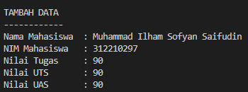
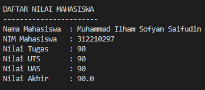
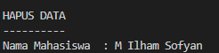

# Praktikum-8

#### Nama : Muhammad Ilham Sofyan Saifudin
#### NIM  : 312210297
#### Kelas: TI 22 A3

## Tugas Praktikum
### Buat program sederhana dengan mengaplikasikan penggunaan class. Buatlah class untuk menampilkan daftar nilai mahasiswa, dengan ketentuan:
* Method tambah() untuk menambahkan data
* Method tampilkan() untuk menampilkan data
* Method hapus(nama) untuk menghapus data bedasarkan nama
* Method ubah(nama) untuk mengubah data bedasarkan nama
* Buat diagram class, flowchart dan penjelasan programnya pada README.md
* Commit dan push repository ke Github

### Langkah-Langkah Pembuatan Program
* Pertama Ketik Import Os untuk memanggil fungsi
```
Import Os
```
* Membuat class data
```
class data_mhsw:
    nama=""
    nim=""
    tugas=""
    uts=""
    uas=""
```
* Setelah itu kita membuat class kedua, yaitu turunan dari class induk
class Data = []:
```
data = []
```
* Kemudian kita masukan fungsinya 

#### Fungsi untuk melihat data
```
def lihat():
    os.system("cls")
    if len(data) <=0:
        no_data()
    else:
        for a in data:
            print("DAFTAR NILAI MAHASISWA")
            print("-----------------------")
            print("Nama Mahasiswa\t: "+a.nama)
            print("NIM Mahasiswa\t: "+str(a.nim))
            print("Nilai Tugas\t: "+str(a.tugas))
            print("Nilai UTS\t: "+str(a.uts))
            print("Nilai UAS\t: "+str(a.uas))
            print("Nilai Akhir\t: "+str(a.akhir))
            print()
```
#### Fungsi untuk menambah data
```
def tambah():
    os.system("cls")
    b = data_mhsw()
    print("TAMBAH DATA")
    print("------------")
    b.nama = (input("Nama Mahasiswa\t: "))
    b.nim = (int(input("NIM Mahasiswa\t: ")))
    b.tugas = (int(input("Nilai Tugas\t: ")))
    b.uts = (int(input("Nilai UTS\t: ")))
    b.uas = (int(input("Nilai UAS\t: ")))
    b.akhir = (b.tugas*30/100) + (b.uts*35/100) + (b.uas*35/100)
    data.append(b)
    print()
```
#### Fungsi untuk mengubah data
```
def ubah():
    os.system("cls")
    if len(data) <=0:
        no_data()
    else:
        nama = data_mhsw()
        print("UBAH DATA")
        print("---------")
        nama = (input("Nama Mahasiswa\t: "))
        for nama in data:
            nama.tugas = (int(input("Nilai Tugas\t: ")))
            nama.uts = (int(input("Nilai UTS\t: ")))
            nama.uas = (int(input("Nilai UAS\t: ")))
            akhir = (nama.tugas*30/100) + (nama.uts*35/100) + (nama.uas*35/100)
        print()
```
#### Fungsi untuk menghapus data
```
def hapus():
    os.system("cls")
    if len(data) <=0:
        no_data()
    else:
        nama = data_mhsw()
        print("HAPUS DATA")
        print("----------")
        nama = (input("Nama Mahasiswa\t: "))
        for nama in data:
            data.remove(nama)
        print()
```

### Hasil Output Dari Program

#### Tambah Data


#### Lihat


#### Ubah Data


#### Hapus Data

